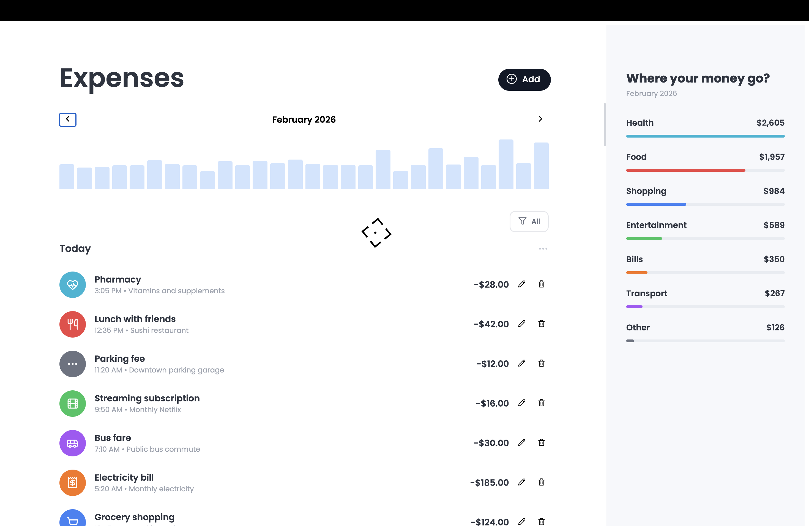

# Expense Tracker

A clean, single-page expense tracking app built with React. No backend, no bloat — just straightforward state management and a UI that stays out of your way.



## What it does

You can add expenses, edit them, delete them, and filter by category. Each expense has a title, optional description, category, and amount. There's a bar chart that visualizes daily spending for a given month, and a sidebar breakdown showing where the money went.

Nothing fancy on the backend side — everything lives in React state via `useReducer`, wrapped in context so components can access what they need without prop drilling.

## Getting started

```bash
npm install
npm run dev
```

That's it. Opens on `http://localhost:5173` by default.

## Key decisions

**State management** — Expenses are managed through `useReducer` with a centralized context (`ExpenseProvider`). The reducer handles three actions: `ADD`, `UPDATE`, and `DELETE`. Month/year navigation state lives alongside it. Everything is exposed through a `useExpenses()` hook so any component in the tree can read or modify expenses without passing props through intermediaries.

**Controlled forms** — The expense modal uses fully controlled inputs. Form state is local to the modal (it doesn't need to be global), and validation runs on submit — title is required, category is required, and amount must be a positive integer.

**Filtering** — Category filtering is local state in `ExpenseListView` since no other component needs to know about it. The bar chart and overview sidebar do their own month-based filtering internally.

**IDs** — Uses `crypto.randomUUID()` for collision-proof expense IDs.

## Built with

- [React 19](https://react.dev/) — UI framework
- [Vite](https://vite.dev/) — Dev server and bundler
- [Lucide React](https://lucide.dev/) — Icons
- [GSAP](https://gsap.com/) — Cursor animation

## Scripts

| Command           | What it does                 |
| ----------------- | ---------------------------- |
| `npm run dev`     | Start dev server with HMR    |
| `npm run build`   | Production build             |
| `npm run preview` | Preview the production build |
| `npm run lint`    | Run ESLint                   |
