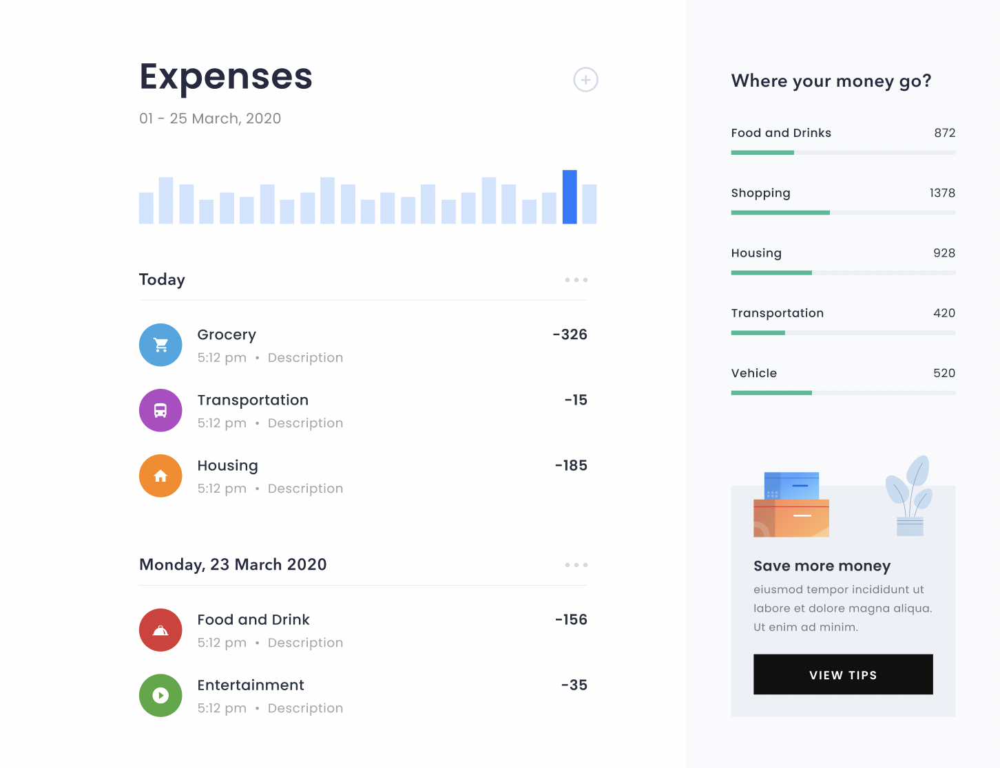

# Expense Tracker

A clean, single-page expense tracking app built with React. No backend, no bloat — just straightforward state management and a UI that stays out of your way.


## Design reference

The UI was designed in Figma first, then built to match. The layout, spacing, typography, and component hierarchy all follow the original mockup. The bar chart, date-grouped expense list, category icons, and the sidebar breakdown were all part of the initial design.



A few things were added beyond the Figma spec during implementation: month navigation with chevrons, a category filter dropdown, inline edit/delete buttons on each expense, and the animated custom cursor. The core layout stayed faithful to the design.

## What it does

You can add expenses, edit them, delete them, and filter by category. Each expense has a title, optional description, category, and amount. There's a bar chart that visualizes daily spending for a given month, and a sidebar breakdown showing where the money went.

Everything lives in React state via `useReducer`, wrapped in context so components can access what they need without prop drilling. No backend needed.

## Getting started

```bash
npm install
npm run dev
```

That's it. Opens on `http://localhost:5173` by default.

## Key decisions

**State management** — Expenses are managed through `useReducer` with a centralized context (`ExpenseProvider`). The reducer handles three actions: `ADD`, `UPDATE`, and `DELETE`. Month/year navigation state lives alongside it. Everything is exposed through a `useExpenses()` hook so any component in the tree can read or modify expenses without passing props through intermediaries.

**Controlled forms** — The expense modal uses fully controlled inputs. Form state is local to the modal (it doesn't need to be global), and validation runs on submit — title is required, category is required, and amount must be a positive integer.

**Filtering** — Category filtering is local state in `ExpenseListView` since no other component needs to know about it. The bar chart and overview sidebar do their own month-based filtering internally.

**IDs** — Uses `crypto.randomUUID()` for collision-proof expense IDs.

## What I'd add next

There's a lot of room to grow this. Some features that would genuinely make it more useful:

- **Summary card** — A top-level card showing total spent this month, average daily spend, and how it compares to last month. The Figma design hints at this kind of overview but the current build doesn't have a dedicated summary component yet.
- **Budget limits** — Set a monthly budget per category and show progress bars that turn red when you're close to or over the limit.
- **Search** — A text search across expense titles and descriptions. Trivial to add, surprisingly useful once you have a few months of data.
- **Date picker on expenses** — Right now `createdAt` is auto-set to the current time. Letting users backdate expenses would make it practical for real use.
- **localStorage persistence** — So your data survives a page refresh. A one-liner with `useEffect` but makes the app feel real.
- **Export to CSV** — Download your expenses as a spreadsheet. Useful for anyone actually tracking spending.
- **Recurring expenses** — Mark an expense as monthly (rent, subscriptions) and auto-generate it each month.
- **Dark mode** — The current design is light-only. A theme toggle with CSS variables would be a clean addition.
- **Responsive layout** — The two-panel layout doesn't work on mobile. A stacked view or a drawer pattern would fix that.

## Built with

- [React 19](https://react.dev/) — UI framework
- [Vite](https://vite.dev/) — Dev server and bundler
- [Lucide React](https://lucide.dev/) — Icons
- [GSAP](https://gsap.com/) — Cursor animation

## Scripts

| Command           | What it does                 |
| ----------------- | ---------------------------- |
| `npm run dev`     | Start dev server with HMR    |
| `npm run build`   | Production build             |
| `npm run preview` | Preview the production build |
| `npm run lint`    | Run ESLint                   |
